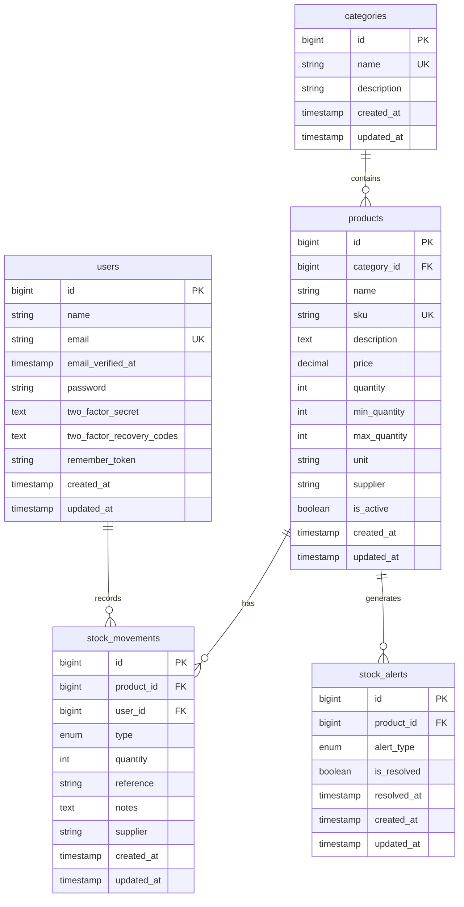

# Entity-Relationship Diagram (ERD) - Inventory Management System

## Database Schema Overview

This inventory management system consists of 5 main entities with their relationships.

## Entities

### 1. users
**Purpose**: Stores user authentication and profile information

| Column | Type | Constraints | Description |
|--------|------|-------------|-------------|
| id | BIGINT | PK, AUTO_INCREMENT | Unique user identifier |
| name | VARCHAR(255) | NOT NULL | User's full name |
| email | VARCHAR(255) | UNIQUE, NOT NULL | User's email address |
| email_verified_at | TIMESTAMP | NULLABLE | Email verification timestamp |
| password | VARCHAR(255) | NOT NULL | Hashed password |
| two_factor_secret | TEXT | NULLABLE | 2FA secret key |
| two_factor_recovery_codes | TEXT | NULLABLE | 2FA recovery codes |
| remember_token | VARCHAR(100) | NULLABLE | Session token |
| created_at | TIMESTAMP | | Record creation time |
| updated_at | TIMESTAMP | | Record last update time |

### 2. categories
**Purpose**: Organizes products into logical groups

| Column | Type | Constraints | Description |
|--------|------|-------------|-------------|
| id | BIGINT | PK, AUTO_INCREMENT | Unique category identifier |
| name | VARCHAR(255) | UNIQUE, NOT NULL | Category name |
| description | VARCHAR(255) | NULLABLE | Category description |
| created_at | TIMESTAMP | | Record creation time |
| updated_at | TIMESTAMP | | Record last update time |

### 3. products
**Purpose**: Stores product/inventory item information

| Column | Type | Constraints | Description |
|--------|------|-------------|-------------|
| id | BIGINT | PK, AUTO_INCREMENT | Unique product identifier |
| category_id | BIGINT | FK, NOT NULL | Reference to categories table |
| name | VARCHAR(255) | NOT NULL | Product name |
| sku | VARCHAR(255) | UNIQUE, NOT NULL | Stock Keeping Unit |
| description | TEXT | NULLABLE | Product description |
| price | DECIMAL(10,2) | NOT NULL | Product price |
| quantity | INTEGER | DEFAULT 0 | Current stock quantity |
| min_quantity | INTEGER | DEFAULT 10 | Minimum stock threshold |
| max_quantity | INTEGER | DEFAULT 100 | Maximum stock threshold |
| unit | VARCHAR(255) | DEFAULT 'pcs' | Unit of measurement |
| supplier | VARCHAR(255) | NULLABLE | Supplier information |
| is_active | BOOLEAN | DEFAULT TRUE | Product active status |
| created_at | TIMESTAMP | | Record creation time |
| updated_at | TIMESTAMP | | Record last update time |

### 4. stock_movements
**Purpose**: Tracks all inventory movements (in/out/adjustments)

| Column | Type | Constraints | Description |
|--------|------|-------------|-------------|
| id | BIGINT | PK, AUTO_INCREMENT | Unique movement identifier |
| product_id | BIGINT | FK, NOT NULL | Reference to products table |
| user_id | BIGINT | FK, NOT NULL | Reference to users table |
| type | ENUM | NOT NULL | Movement type: 'in', 'out', 'adjustment', 'return' |
| quantity | INTEGER | NOT NULL | Quantity moved (positive or negative) |
| reference | VARCHAR(255) | NULLABLE | Reference number/document |
| notes | TEXT | NULLABLE | Additional notes |
| supplier | VARCHAR(255) | NULLABLE | Supplier for incoming stock |
| created_at | TIMESTAMP | | Record creation time |
| updated_at | TIMESTAMP | | Record last update time |

### 5. stock_alerts
**Purpose**: Manages inventory alerts and notifications

| Column | Type | Constraints | Description |
|--------|------|-------------|-------------|
| id | BIGINT | PK, AUTO_INCREMENT | Unique alert identifier |
| product_id | BIGINT | FK, NOT NULL | Reference to products table |
| alert_type | ENUM | NOT NULL | Alert type: 'low_stock', 'overstocked', 'expiring' |
| is_resolved | BOOLEAN | DEFAULT FALSE | Alert resolution status |
| resolved_at | TIMESTAMP | NULLABLE | Alert resolution timestamp |
| created_at | TIMESTAMP | | Record creation time |
| updated_at | TIMESTAMP | | Record last update time |

## Relationships

### One-to-Many Relationships

1. **categories → products** (1:M)
   - One category can have multiple products
   - Each product belongs to exactly one category
   - Foreign Key: `products.category_id` references `categories.id`
   - On Delete: CASCADE (deleting category deletes all its products)

2. **products → stock_movements** (1:M)
   - One product can have multiple stock movements
   - Each stock movement belongs to exactly one product
   - Foreign Key: `stock_movements.product_id` references `products.id`
   - On Delete: CASCADE

3. **users → stock_movements** (1:M)
   - One user can record multiple stock movements
   - Each stock movement is recorded by exactly one user
   - Foreign Key: `stock_movements.user_id` references `users.id`
   - On Delete: CASCADE

4. **products → stock_alerts** (1:M)
   - One product can have multiple stock alerts
   - Each stock alert belongs to exactly one product
   - Foreign Key: `stock_alerts.product_id` references `products.id`
   - On Delete: CASCADE

## ERD Diagram (Mermaid)



## Enhanced ERD with Cardinality (Crow's Foot Notation)

```
┌─────────────┐
│   users     │
│─────────────│
│ • id (PK)   │
│   name      │
│   email (UK)│
│   password  │
│   ...       │
└──────┬──────┘
       │
       │ records (1:M)
       │
       ↓
┌──────────────────┐
│ stock_movements  │
│──────────────────│
│ • id (PK)        │
│ ○ product_id (FK)│─────┐
│ ○ user_id (FK)   │     │
│   type           │     │ belongs to (M:1)
│   quantity       │     │
│   reference      │     │
│   supplier       │     ↓
│   notes          │ ┌───────────┐
│   ...            │ │ products  │
└──────────────────┘ │───────────│
                     │ • id (PK) │
┌─────────────┐     │ ○ category_id (FK)
│ categories  │     │   name     │
│─────────────│     │   sku (UK) │
│ • id (PK)   │     │   price    │
│   name (UK) │     │   quantity │
│   ...       │     │   min_qty  │
└──────┬──────┘     │   max_qty  │
       │            │   ...      │
       │            └─────┬──────┘
       │ contains (1:M)   │
       │                  │
       └──────────────────┘
                          │
                          │ generates (1:M)
                          │
                          ↓
                  ┌───────────────┐
                  │ stock_alerts  │
                  │───────────────│
                  │ • id (PK)     │
                  │ ○ product_id  │
                  │   alert_type  │
                  │   is_resolved │
                  │   resolved_at │
                  │   ...         │
                  └───────────────┘

Legend:
• = Primary Key
○ = Foreign Key
UK = Unique Key
1:M = One-to-Many relationship
M:1 = Many-to-One relationship
```

## Database Indexes

### Primary Keys
- `users.id`
- `categories.id`
- `products.id`
- `stock_movements.id`
- `stock_alerts.id`

### Unique Constraints
- `users.email`
- `categories.name`
- `products.sku`

### Foreign Key Indexes
- `products.category_id`
- `stock_movements.product_id`
- `stock_movements.user_id`
- `stock_alerts.product_id`

### Recommended Additional Indexes
- `products.is_active` - For filtering active products
- `stock_movements.type` - For filtering movement types
- `stock_movements.created_at` - For time-based queries
- `stock_alerts.is_resolved` - For filtering unresolved alerts
- `stock_alerts.alert_type` - For filtering alert types

## Business Logic & Computed Fields

### Product Model
- **stock_status**: Computed attribute based on quantity vs min_quantity
  - 'low': quantity ≤ min_quantity
  - 'normal': min_quantity < quantity < max_quantity
  - 'high': quantity ≥ max_quantity

### Stock Movement Model
- **type_icon**: Visual representation of movement type
- **type_label**: Human-readable movement type

### Stock Alert Model
- **alert_icon**: Visual representation of alert type
- **alert_label**: Human-readable alert type

## Data Integrity Rules

1. **Cascading Deletes**
   - Deleting a category deletes all associated products
   - Deleting a product deletes all associated stock movements and alerts
   - Deleting a user deletes all their stock movement records

2. **Referential Integrity**
   - All foreign keys must reference valid records
   - Products must have a valid category
   - Stock movements must have valid product and user

3. **Business Constraints**
   - SKU must be unique across all products
   - Email must be unique across all users
   - Category names must be unique
   - Stock quantity should not be negative (enforced at application level)

4. **Enum Constraints**
   - stock_movements.type: 'in', 'out', 'adjustment', 'return'
   - stock_alerts.alert_type: 'low_stock', 'overstocked', 'expiring'
