# Use Case Diagram - Inventory Management System

## Actors
- **User (Authenticated)**: Logged-in staff/admin managing inventory

## Use Cases

### 1. Authentication & User Management
- **Login**: User authenticates to access the system
- **Logout**: User ends their session
- **Manage Profile**: User updates their profile information
- **Change Password**: User changes their password
- **Enable/Disable 2FA**: User manages two-factor authentication settings

### 2. Inventory Management
- **View Dashboard**: User views inventory overview and statistics
- **View Product List**: User browses all products in inventory
- **Add Product**: User adds a new product to the inventory
  - Includes: Select category, set SKU, price, quantity, min/max thresholds
- **Edit Product**: User updates existing product information
- **View Product Details**: User views detailed information about a specific product
  - Includes: Stock history, alerts, and statistics
- **Activate/Deactivate Product**: User toggles product active status

### 3. Category Management
- **View Categories**: User views all product categories
- **Add Category**: User creates a new product category
- **Edit Category**: User updates category information
- **Delete Category**: User removes a category (if no products linked)

### 4. Stock Movement Management
- **Record Stock In**: User records incoming stock
  - Includes: Specify quantity, supplier, reference number, notes
- **Record Stock Out**: User records outgoing stock (sales/usage)
  - Includes: Specify quantity, reference number, notes
- **Record Stock Adjustment**: User adjusts stock for corrections
  - Includes: Specify quantity change, reason
- **Record Stock Return**: User records returned items
  - Includes: Specify quantity, reference number, notes
- **View Stock Movement Report**: User views all stock movements with filters
  - Filter by: Product, type, date range, user

### 5. Alert Management
- **View Stock Alerts**: User views all active alerts
  - Alert types: Low stock, Overstocked, Expiring
- **Resolve Alert**: User marks an alert as resolved
- **Monitor Low Stock**: System automatically generates alerts when stock falls below minimum
- **Monitor Overstock**: System automatically generates alerts when stock exceeds maximum

### 6. Reporting & Activity Log
- **View Activity Log**: User views all system activities
  - Shows: User actions, timestamps, affected products
- **Generate Stock Reports**: User generates inventory reports
- **Export Data**: User exports reports to various formats

## System Features
- **Real-time Stock Updates**: Stock quantities update automatically after movements
- **Automatic Alert Generation**: System monitors stock levels and generates alerts
- **Audit Trail**: All actions are logged with user information and timestamps
- **Data Validation**: System validates SKU uniqueness, quantity constraints

## Use Case Diagram (Mermaid)

```mermaid
graph TB
    User((User<br/>Authenticated))
    
    %% Authentication
    User --> UC1[Login]
    User --> UC2[Manage Profile]
    User --> UC3[Change Password]
    User --> UC4[Enable/Disable 2FA]
    
    %% Inventory Management
    User --> UC5[View Dashboard]
    User --> UC6[View Product List]
    User --> UC7[Add Product]
    User --> UC8[Edit Product]
    User --> UC9[View Product Details]
    User --> UC10[Activate/Deactivate Product]
    
    %% Category Management
    User --> UC11[View Categories]
    User --> UC12[Add Category]
    User --> UC13[Edit Category]
    User --> UC14[Delete Category]
    
    %% Stock Movement
    User --> UC15[Record Stock In]
    User --> UC16[Record Stock Out]
    User --> UC17[Record Stock Adjustment]
    User --> UC18[Record Stock Return]
    User --> UC19[View Stock Movement Report]
    
    %% Alert Management
    User --> UC20[View Stock Alerts]
    User --> UC21[Resolve Alert]
    
    %% Reporting
    User --> UC22[View Activity Log]
    User --> UC23[Generate Stock Reports]
    
    %% Include relationships
    UC7 -.->|includes| UC12
    UC8 -.->|includes| UC12
    UC9 -.->|includes| UC19
    UC9 -.->|includes| UC20
    
    %% Extend relationships
    UC5 -.->|extends| UC20
    
    style User fill:#4A90E2,stroke:#2E5C8A,stroke-width:3px,color:#fff
    
    classDef auth fill:#E8F5E9,stroke:#4CAF50,stroke-width:2px
    classDef inventory fill:#E3F2FD,stroke:#2196F3,stroke-width:2px
    classDef category fill:#FFF3E0,stroke:#FF9800,stroke-width:2px
    classDef stock fill:#F3E5F5,stroke:#9C27B0,stroke-width:2px
    classDef alert fill:#FFEBEE,stroke:#F44336,stroke-width:2px
    classDef report fill:#E0F7FA,stroke:#00BCD4,stroke-width:2px
    
    class UC1,UC2,UC3,UC4 auth
    class UC5,UC6,UC7,UC8,UC9,UC10 inventory
    class UC11,UC12,UC13,UC14 category
    class UC15,UC16,UC17,UC18,UC19 stock
    class UC20,UC21 alert
    class UC22,UC23 report
```

## Actor-Use Case Matrix

| Use Case | User |
|----------|------|
| Authentication & Profile | ✓ |
| Dashboard & Reporting | ✓ |
| Product Management | ✓ |
| Category Management | ✓ |
| Stock Movement | ✓ |
| Alert Management | ✓ |
| Activity Logging | ✓ |

## Business Rules

1. **Stock Validation**
   - Stock cannot go below zero
   - SKU must be unique
   - Products must belong to a category

2. **Alert Generation**
   - Low stock alert when quantity ≤ min_quantity
   - Overstock alert when quantity ≥ max_quantity
   - Alerts are auto-generated by the system

3. **Stock Movements**
   - All movements must be recorded with a user
   - Movements immediately update product quantity
   - Movement types: IN, OUT, ADJUSTMENT, RETURN

4. **User Actions**
   - All actions require authentication
   - All product modifications are logged
   - User information is tracked for audit purposes

5. **Category Rules**
   - Categories cannot be deleted if products exist
   - Category names must be unique
